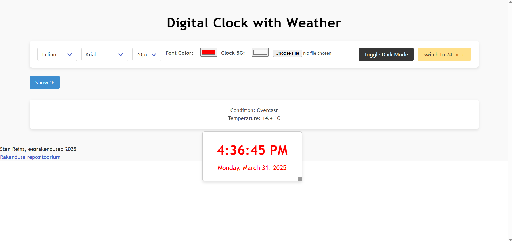

# 1-kodutoo
Sten Reins

## Pilt rakendusest

## Funktsioonid

Rakendus võimaldab kasutajal:
1. vahetada ajatsooni (hetkel valikus viis tükki)
1. muuta fonti, selle suurust ja värvi
1. muuta kella taustavärvi
1. vahetada taustapilti
1. vahetada light- ja dark mode-i vahel
1. muuta aja formaati
1. vahetada Celsiuse ja Fahrenheiti vahel
1. muuta kasti suurust ja seda ekraanil liigutada.